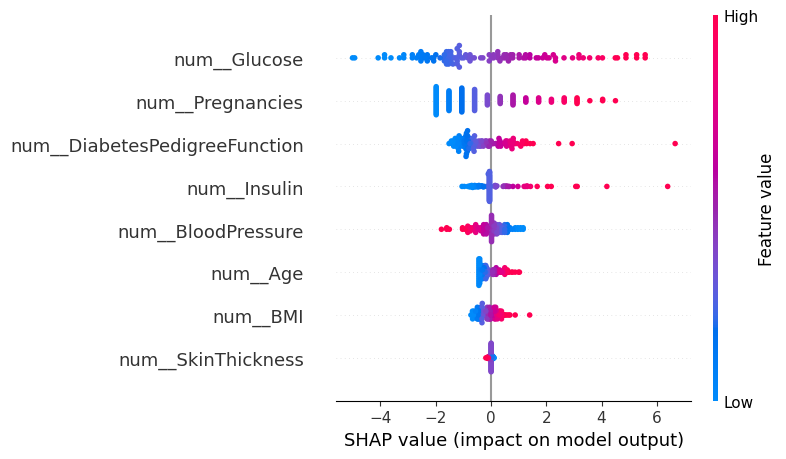
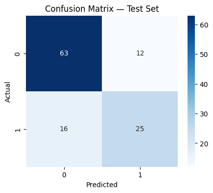

# Diagnóstico de Diabetes com Machine Learning

Este projeto aplica técnicas de Machine Learning para prever a presença de
diabetes a partir de dados clínicos e demográficos. O modelo desenvolvido tem
como objetivo atuar como um sistema de apoio à decisão clínica, não substituindo
o diagnóstico médico profissional.

---

## Dataset

O conjunto de dados utilizado é o Pima Indians Diabetes Dataset, disponibilizado
publicamente na plataforma Kaggle. A base contém registros de pacientes do sexo
feminino, com variáveis clínicas relevantes como nível de glicose, índice de
massa corporal (BMI), pressão arterial, idade e histórico familiar.

Variável alvo:
- `Outcome`: 1 indica presença de diabetes, 0 indica ausência.

---

## Pipeline do Projeto

1. Análise Exploratória de Dados (EDA)
   - Análise da distribuição das classes
   - Estatísticas descritivas
   - Análise de correlação
   - Identificação de valores inválidos

2. Pré-processamento
   - Substituição de valores zero por valores ausentes
   - Imputação pela mediana
   - Divisão dos dados em treino, validação e teste (70% / 15% / 15%)
   - Normalização das variáveis com StandardScaler

3. Modelagem
   - Regressão Logística com Grid Search
   - Árvore de Decisão com Randomized Search
   - Classificador SGD

   A otimização dos hiperparâmetros priorizou a métrica de recall, devido à
   relevância clínica de minimizar falsos negativos.

4. Avaliação
   - Seleção do modelo com base no conjunto de validação
   - Avaliação final no conjunto de teste
   - Métricas: Acurácia, Precisão, Recall e F1-score

5. Interpretabilidade
   - Análise dos coeficientes do modelo
   - Explicações globais e individuais com SHAP

---

## Resultados

Os resultados indicam que o modelo SGDClassifier apresentou o melhor desempenho
em termos de recall no conjunto de teste, métrica priorizada devido à importância
clínica de minimizar falsos negativos.

A análise de interpretabilidade com SHAP demonstrou que o nível de glicose, o BMI
e a idade são as variáveis mais influentes nas previsões do modelo, em conformidade
com o conhecimento clínico existente.


**Figura 1 — SHAP Summary Plot**

Distribuição global da importância das variáveis no modelo final.



**Figura 2 — Matriz de Confusão** 

Resultados do modelo SGDClassifier no conjunto de teste.


---

## Considerações Éticas

Este projeto possui caráter exclusivamente acadêmico. O modelo desenvolvido não
substitui a avaliação médica profissional e deve ser utilizado apenas como
ferramenta de apoio à decisão clínica.

---

## Executando com Docker

```bash
docker build -t diabetes-ml .
docker run --rm diabetes-ml
```

## Como Executar o Projeto

```bash
python -m venv .venv
source .venv/bin/activate  # Windows: .venv\Scripts\activate

pip install -r requirements.txt

python src/train.py
```
